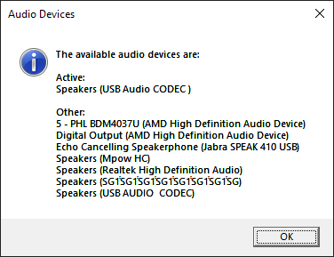

   

# Introduction 👀

Better Busylight is busy light controller software that changes the light state based on audio sessions, web cam usage and system lock state. It was developed because I wanted the busylight to show I was actually in a call, rather than just red because there was an entry in my calendar.

# Key Features ✨

* Activity driven - you specify what your busy light displays in five states
  * When machine is locked
  * When neither camera nor conference audio are active
  * When only conference audio is active
  * When only the camera is active
  * When both conference audio and the camera are active
* Customisable sequences
  * Specify solid colour, a sequence of colours, fades between two colours or any combination of those
  * Specify a frequency at which the light pulses
* Support for multiple busylight devices

# How to run it 🚀

BetterBusylight is a .NET Framework application. You can run it on any version of Windows by simply double clicking it. If you want it to run when you log into windows, press Windows+R, then enter `shell:startup`. You can then create a shortcut to the BetterBusylight application which will start when Windows does.

# Configuration 🔧

BetterBusylight is configured by modifying the `config.xml` file in the application directory. Here is the default content of that configuration file:

```
<config>
  <audioDevice searchString="Jabra" />
  <lightStyles>
    <locked>
	  <static color="#141414" />
	</locked>
    <idle>
	  <fade from="#008000" to="#0000FF" duration="1.5" />
	  <fade from="#0000FF" to="#008000" duration="1.5" />
	</idle>
    <audioOnly flashFrequency="0.75">
	  <static color="#ff4000" />
	</audioOnly>
    <cameraOnly flashFrequency="0.75">
	  <static color="#800080" />
	</cameraOnly>
    <audioAndCamera flashFrequency="1.5">
	  <static color="#ff0000" />
	</audioAndCamera>
  </lightStyles>
</config>
```

The `<audioDevice>` node specifies what audio device should be counted as 'Conference Audio'. More on that below...

The `<lightStyles>` node contains the different sequences - `<locked>`, `<idle>`, `<audioOnly>`, `<cameraOnly>` and `<audioAndCamera>`. For each of these, you can optionally specify a frequency at which the light should pulse (in Hz) by adding a `flashFrequency="2"` attribute - where 2 is the desired frequency. You can see in the default config that the audioOnly, cameraOnly and audioAndCamera nodes use a static colour that pulses.

You can add as many elements into each node as you like. For example, if you wanted a rainbow effect when no camera or audio was active, you could configure the `<idle>` node like this:

```
    <idle>
	  <static color="#ff0000" duration="0.5" />
	  <static color="#ffff00" duration="0.5" />
	  <static color="#00ff00" duration="0.5" />
	  <static color="#00ffff" duration="0.5" />
	  <static color="#0000ff" duration="0.5" />
	  <static color="#ff00ff" duration="0.5" />
	</idle>
```

The `<idle>` node, by default, fades from green to blue and back. Again, you can configure it to do whatever you'd like.

# What is 'conference audio'? 🎧

 If you run `BetterBusylight.exe list` from a command line, it will pop up a message box that lists all the audio devices on your system. Simply enter an identifiable piece of text in the `searchString` attribute of the `<audioDevice>` node, and Better Busylight will monitor that device.
 
 For example, the device list on my machine looks like this:
 


My headset is made by 'MPOW' - so I might have `<audioDevice searchString="MPOW" />` as my configuration.

# Any ideas? 💡

I'd love to hear if you have any ideas about how to make this app better. If you do, feel free to create an issue on the GitHub repository!

# Device support 🚨

Currently, Better Busylight only supports the kuando Busylight products. If you have a different branch of light and you have a spare one, please get in touch!

